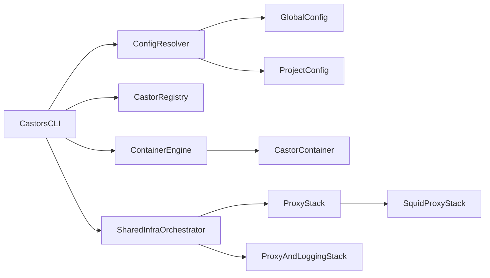

# Castors Plan

## Goal

Build `castors` as a Rust CLI for running coding agents inside isolated containers, with containerization treated as a first-class concern from the start rather than an add-on.

The plan is based on the intent in [AGENTS.md](/Users/jzeller/castors/AGENTS.md): a simple CLI for managing named castors, mounting project directories, and evolving toward restricted networking, logging, and optional shared telemetry.

## Decisions Made

- Language: Rust.
- Initial runtime: Docker-compatible local runtime.
- Initial orchestration: `docker` and `docker compose`.
- Priority: container lifecycle and isolation are in scope from the beginning.
- Portability strategy: define a narrow engine-independent boundary so a future Podman or Kubernetes backend remains possible.
- Initial proxy strategy: use a shared `Squid` container stack as the first concrete implementation of network proxying.

## Product Scope

### In scope for the first real implementation

- `castors add image-tag dir castor-name`
- `castors exec castor-name`
- `castors rm castor-name`
- `castors prune`
- Global YAML config under `~/.config/castors/`
- Project-local override config under `.castors/`
- Shared infrastructure support for network isolation and logging
- An initial `Squid`-based proxy stack managed as shared infrastructure
- A backend abstraction that keeps Docker-specific code from leaking through the whole codebase

### Explicit non-goals for the first milestone

- Kubernetes support
- Telemetry dashboards such as Grafana
- Fully generic support for every container engine capability
- Complex multi-node orchestration

## Architectural Position

The current direction makes sense, with one important refinement:

- Use Docker and Compose first because the project needs working container orchestration early.
- Keep the backend abstraction capability-based, not purely theoretical.
- Accept that some features, especially networking and shared services, may be implemented first for Docker and exposed as optional capabilities in other backends later.

This avoids the common trap of designing an interface that looks portable on paper but actually encodes Docker behavior everywhere.

It also suggests a clean split for networking:

- The runtime adapter is responsible for creating networks, attaching containers, and managing lifecycle.
- The proxy stack is responsible for mediating egress and providing a stable target for logging and policy.
- `Squid` is the first proxy implementation, but not the abstraction boundary itself.

## Recommended Runtime Split

Use the Docker toolchain in two layers:

- `docker` for castor container lifecycle and interactive exec flows
- `docker compose` for shared singleton services such as proxy, logging, and other supporting infrastructure

This split keeps the common path simple while still giving the project a place to model the "run once" infrastructure described in [AGENTS.md](/Users/jzeller/castors/AGENTS.md).

## Suggested System Design

## Core Components

### `CastorsCLI`

- Parses commands and flags.
- Translates user intent into application operations.
- Stays thin; it should not know Docker details directly.

### `ConfigResolver`

- Loads global config from `~/.config/castors/`.
- Loads project-local config from `.castors/`.
- Applies deterministic merge rules.
- Produces a normalized runtime configuration.

### `CastorRegistry`

- Stores stable metadata for named castors.
- Tracks image reference, mount directory, engine backend, and created resources.
- Lets `exec`, `rm`, and `prune` operate predictably across sessions.

### `ContainerEngine`

- Defines the engine-facing interface for lifecycle operations.
- First implementation: `DockerEngine`.
- Future candidates: `PodmanEngine`, possibly a Kubernetes-oriented backend later.

### `SharedInfraOrchestrator`

- Manages shared services that should exist once per machine or workspace.
- First target: network isolation and logging support.
- Initial implementation can be Docker Compose based.

### `ProxyStack`

- Represents the proxy-oriented egress control layer independently from the container engine.
- Defines what shared networking services must exist for castors to run safely.
- Provides the seam where `Squid` can be used first and another proxy strategy can be introduced later.

### `SquidProxyStack`

- First concrete implementation of `ProxyStack`.
- Runs as a shared containerized service.
- Gives the project an engine-portable proxy component even if network attachment and anti-bypass rules remain engine-specific.
- Supports a normal configuration path for common choices (for example the Squid image tag) and an explicit expert escape hatch for fully custom infra files.

## Shared Infra Customization

The default path should stay simple: `castors` owns the Compose file and the generated `squid.conf`, and user config controls high-level policy such as images, allowed hosts, secrets, logging options, and other supported knobs.

Some users will still need to run a patched Squid image, add sidecars, wire extra logging, or use site-specific Compose settings. The plan should support that through two layers:

- **Supported knobs**: explicit config fields for central choices that are expected to vary. The first one should be the Squid image tag, e.g. a global setting like `infra.squid.image: ubuntu/squid:5.2-22.04_beta`. Similar fields can be added later for other central infra aspects when they become common enough to deserve a stable interface.
- **Full file overrides**: optional paths to a complete `compose.yaml` and/or `squid.conf`. When these are set, `castors` should use the supplied files instead of materializing its built-in templates. This is an expert mode: the user is responsible for preserving the labels, service names, network names, mounted paths, health behavior, and any other contracts that the CLI relies on.

The override behavior should be documented as an escape hatch, not as the primary extension mechanism. If a customization becomes common, it should graduate from "replace the whole file" into a typed config field so `castors` can validate it.

## Engine Interface Principles

The backend abstraction should be intentionally small. It should model what `castors` needs, not every engine feature.

Recommended operations:

- `ensure_infra()`
- `create_castor()`
- `start_castor()`
- `exec_castor()`
- `remove_castor()`
- `prune_castors()`
- `inspect_castor()`
- `capabilities()`

Recommended rules:

- Separate per-castor lifecycle from shared-infra lifecycle.
- Keep proxy management separate from core castor lifecycle even when both are orchestrated by the same backend.
- Return structured metadata rather than raw command output where possible.
- Model unsupported features explicitly through capabilities instead of pretending all backends are equivalent.
- Keep engine-specific details inside adapter implementations.

## Networking Model

The initial networking plan should explicitly include a shared `Squid` proxy stack.

That is useful for two reasons:

- It moves the first proxy implementation into a portable shared service rather than relying only on runtime-native networking features.
- It gives future backends a clearer target: they need to connect castors to the proxy model, not re-invent policy semantics from scratch.

At the same time, the plan should stay honest about what remains runtime-specific:

- Network creation and container attachment
- Environment and proxy variable injection
- DNS and routing details
- Hard anti-bypass enforcement

So the right boundary is:

- `ContainerEngine`: how containers and networks are created and connected
- `ProxyStack`: how egress is mediated and logged
- `SquidProxyStack`: the first concrete proxy implementation

## Docker-First Implementation Notes

### Why Docker is the right first backend

- It is the simplest path to a usable containerized MVP.
- It supports both interactive shell flows and shared service orchestration.
- It keeps the project aligned with the original "keep it simple" intent.

### Why `Squid` belongs in the initial plan

- It matches the original direction in [AGENTS.md](/Users/jzeller/castors/AGENTS.md), where a proxy-style isolation layer is already anticipated.
- It reduces long-term coupling to one runtime's native networking model.
- It gives the project a concrete first answer for proxying and logging without pretending runtime portability is free.

### Why Rust is still a strong fit

- The project is integration-heavy, but it still benefits from a reliable native CLI.
- Rust is well suited for command orchestration, config modeling, filesystem work, and structured error handling.
- Distribution later is much easier with a single compiled binary than with Python or Node-based packaging.

## Options Considered

### Runtime strategy options

- Docker-first: recommended.
- Podman-compatible first: viable later if the Docker adapter boundary stays clean.
- Kubernetes-first: not recommended for the first implementation because it adds too much control-plane complexity.

### Orchestration strategy options

- Use `docker` only: simpler, but awkward for shared singleton services.
- Use `docker compose` for everything: possible, but heavier for simple castor lifecycle commands.
- Split `docker` and `docker compose`: recommended balance.

### Proxy strategy options

- Rely only on runtime-native networking: simpler initially, but more tightly coupled to the first backend.
- Introduce a shared proxy stack from day one: recommended.
- Delay proxying entirely until later: weaker fit for the safety goal of the project.

### Portability strategy options

- Fully generic abstraction from day one: too abstract too early.
- Docker-only forever: too limiting for the stated long-term goal.
- Narrow capability-based abstraction: recommended.

## Phase Plan

### Phase 1: Architecture and scaffolding

- Initialize the Rust CLI project.
- Define command surface, config model, registry model, and engine trait.
- Decide where state lives on disk.
- Document Compose-managed shared infrastructure boundaries.
- Define `ProxyStack` and `SquidProxyStack` as separate concerns from `ContainerEngine`.

### Phase 2: Docker backend MVP

- Implement `DockerEngine` using `docker` subprocess calls.
- Implement castor registry and config resolution.
- Support `add`, `exec`, `rm`, and `prune`.
- Support bind mounts and image tags as described in [AGENTS.md](/Users/jzeller/castors/AGENTS.md).

### Phase 3: Shared infrastructure for isolation

- Add `SharedInfraOrchestrator`.
- Stand up the initial `Squid` proxy/logging stack with Compose.
- Attach castors to the correct network and routing model.
- Inject proxy configuration into castors in a deterministic way.
- Define the first anti-bypass strategy and document where it depends on runtime capabilities.
- Validate the user experience around startup, health, and teardown.

### Phase 4: Hardening and second backend

- Improve observability and error messages.
- Refine capability reporting for engine backends.
- Evaluate a second backend such as Podman only after the Docker flow is stable.

## Risks

- The hardest part is not the CLI code itself, but making container lifecycle, networking, and shared services predictable.
- A backend abstraction can become misleading if it is too broad too early.
- Network isolation requirements may still force Docker-specific behavior at first; the plan should treat that honestly even with `Squid` in the stack.
- A shared proxy improves portability, but it does not eliminate engine-specific enforcement work.

## Recommendations

- Proceed with Rust.
- Prioritize a working Docker backend before chasing portability.
- Use `docker compose` for shared singleton infrastructure, not necessarily for every castor lifecycle operation.
- Include `Squid` in the initial plan as the first shared proxy implementation.
- Keep the engine abstraction narrow and capability-based.

## Open Questions For The Next Iteration

- Should castor state be stored as YAML, JSON, or SQLite?
- Should shared infrastructure be started automatically on first use or through an explicit command such as `castors infra up`?
- How strict should the first networking policy be: best-effort proxy routing, or hard enforcement from day one?
